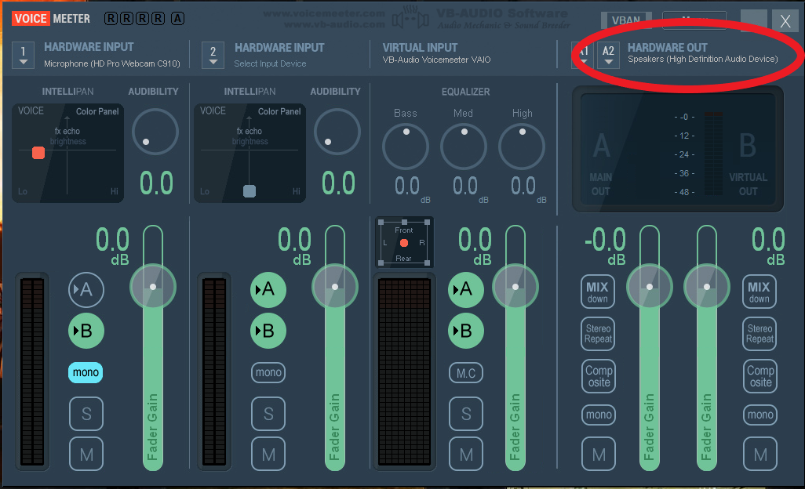
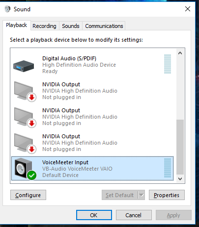
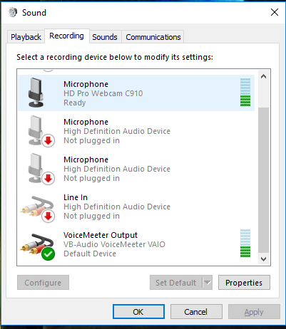
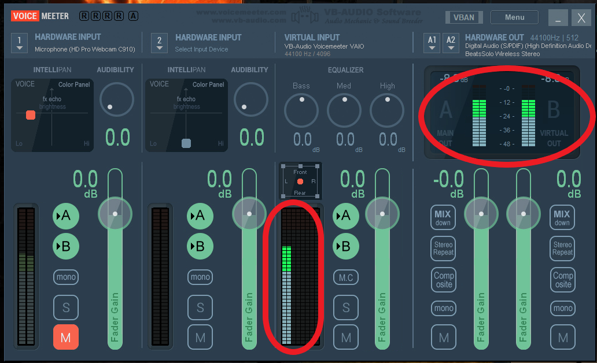
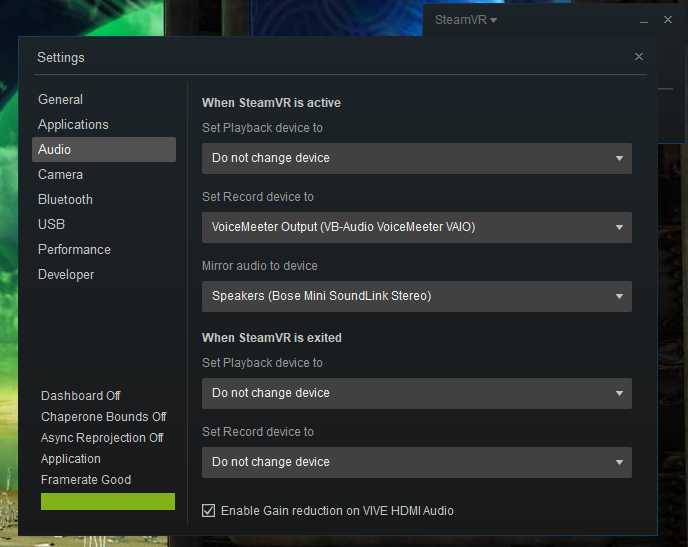
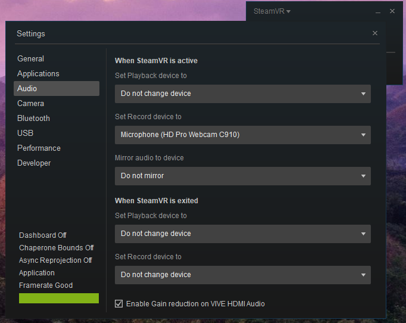

Introduction
============

This document will explain how to set-up Spektra VR on your PC in two different configurations. Spektra was developed by Headbang VR. Josh Simmons is the creative lead and Mark Micchelli is the technical lead.

Downloading
==============================

The program can be found on this repo's ["Releases" page.](https://github.com/jcpsimmons/spektra-public-prerelease/releases)

Using Spektra VR with PC Audio
==============================

In order to use Spektra VR with PC audio, you will need a few extra pieces of software:

*   [VoiceMeeter Virtual Audio Mixer](https://www.google.com/url?q=https://www.vb-audio.com/Voicemeeter/index.htm&sa=D&ust=1524013559699000)
*   Audio playback software such as [Spotify](https://www.google.com/url?q=https://www.spotify.com/&sa=D&ust=1524013559699000), you’ll be able to use any sound source on your computer, but we’ll use Spotify for this example.

Instructions
------------

1.  Install VoiceMeeter
2.  Restart your computer
3.  Open SteamVR
4.  Open VoiceMeeter
5.  Click “A1” and select the output device you want to hear the audio on
6.  Navigate to the Windows Control Panel and open the Sound configuration window
7.  Under the Playback tab, highlight “VoiceMeeter Input” and click “Set Default”
8.  Under the Recording tab, highlight “VoiceMeeter Output” and click “Set Default”
9.  Press “OK”
10.  Open Spotify, or your chosen media player and play some music
11.  Ensure that VoiceMeeter is receiving signal in its Virtual Input, and that you can hear this audio in your selected Hardware out device
12.  Open SteamVR settings
13.  Navigate to the “Audio” tab
14.  Set the Record device to “VoiceMeeter Output”
15.  Launch Spectra VR

Using Spektra VR with a Microphone
==================================

Any microphone can be used with Spektra VR, but it is highly recommended that the built in microphone found in the Oculus Rift, or HTC Vive is not used due to the spectrum limiting and noise reduction built into these devices. A Shure SM57 or equivalent is recommended.

Instructions
------------

1.  Hook up microphone either via the PC’s built in interface or through an external one (separate drivers may be required, consult the owner’s manual for your audio interface)
2.  Launch SteamVR
3.  In the SteamVR settings navigate to the “Audio” tab, and change the “Set Record device to” parameter to your microphone. In this example I’ve selected my built in webcam microphone.
4.  Launch Spektra VR
